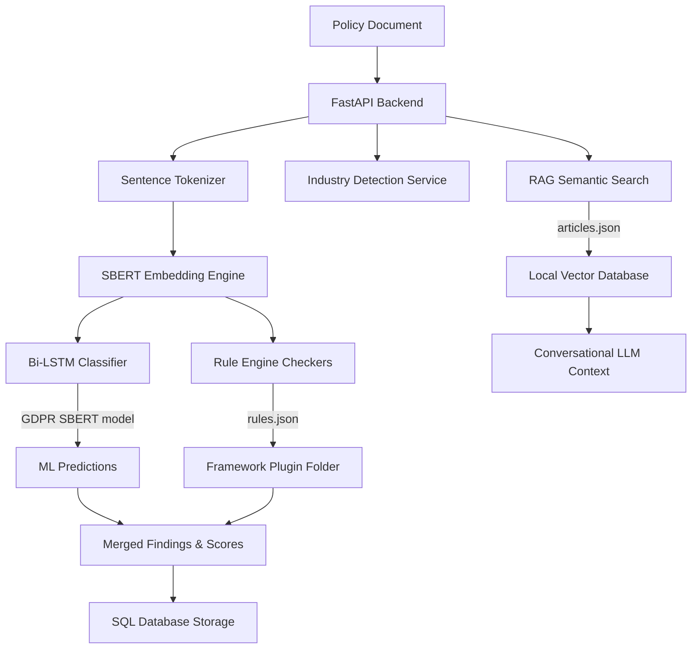

# PolicyGuard AI — Compliance Auditor & Chat Assistant

PolicyGuard AI is an automated privacy policy auditor and regulatory chatbot platform. The application scans organization privacy agreements, identifies compliance violations, recommends specific clause modifications, and classifies the organisation's industry sector to provide tailored legal recommendations.

---

## 🎯 Core Capabilities
* **Multi-Framework Evaluation**: Audit policy documents against multiple regulatory frameworks simultaneously (*GDPR, HIPAA, CCPA, PCI DSS, UK GDPR*).
* **Industry Sector Classifier**: Automatically detects the organization's business sector (*Healthcare, Finance, E-commerce, Tech/SaaS, or Education*) from the text and suggests sector-specific privacy clauses.
* **AI Suggested Rewrite Tool**: Suggests direct compliance rewrites for violated clauses using LLM intelligence with customizable provider selections (*Groq Llama 3.3, OpenAI GPT-4o, or local template fallbacks*).
* **Grounded RAG Chatbot**: Chat directly with legal regulations powered by a high-performance semantic search database indexed against official article contents.
* **Auditing Dashboard & Executive Reports**: Interactive charts tracking framework scores, recent critical violations, and print-ready PDF executive summaries.

---

## 🛠️ Technology Stack & Tooling
* **Frontend**:
  * **Framework**: React 19 + TypeScript + Vite.
  * **Styling**: Tailwind CSS v4 (native variables, utility optimizations).
  * **Icons & Charts**: `lucide-react` & `recharts`.
* **Backend**:
  * **Framework**: Python 3.12 + FastAPI (Lifespan resource management).
  * **Database**: SQLite (SQLAlchemy ORM) with Postgres compatibility.
  * **Testing**: Pytest (Automated unit validation suites).
* **Machine Learning & RAG**:
  * **Embedding Model**: Sentence-Transformers `all-MiniLM-L6-v2` (SBERT).
  * **Classification**: Bi-Directional LSTM neural network for sentence classification.
  * **Vector Database**: SQL-backed cosine similarity vector table storing serialized float32 NumPy vectors.
  * **NLP Tokenization**: NLTK sentence tokenize framework.
  * **LLM Clients**: OpenAI SDK supporting both OpenAI and Groq APIs.

---

## 📐 Architecture & System Design


### 1. The Plugin Architecture
The core engine has **zero framework-specific code**. All compliance parameters are structured as plugins inside [`backend/compliance/frameworks/`](file:///c:/Users/ayush/Document/V_Sem/SI_2/GDPR_compliance_checker/backend/compliance/frameworks/):
* `rules.json`: Declares forbidden or required text patterns.
* `articles.json`: Declares official regulatory articles for RAG lookup.
* `severity.json`: Map categories to severity weightings.

### 2. Dual-Engine Audit Flow
When auditing a document, the platform runs two parallel pipelines:
* **The Classifier Model**: Translates text into SBERT sentence embeddings and evaluates them against the 7 GDPR principles using the Bi-LSTM model.
* **The Rule Engine**: Processes the text against dynamic regex/keyword rule patterns configured in each framework's plugin folder.

---

## 🚀 Scalability Blueprint

As PolicyGuard AI transitions to production, the system is designed to scale horizontally across three dimensions:

### 1. Vector Database Upgrades
* **Current**: Local NumPy-based dot product matrix calculation in SQLite.
* **Scale Option**: Swap the custom `vector_store.py` module with a dedicated cloud-native vector database like **Qdrant** or **pgvector**. This allows millions of chunks to be queried in milliseconds using HNSW indices.

### 2. Distributed ML & Model Serving
* **Current**: PyTorch models are loaded directly into the FastAPI process memory.
* **Scale Option**: Offload SBERT embeddings and Bi-LSTM classification tasks to a standalone model server like **Triton Model Analyzer** or **Hugging Face TGI**. The main web server remains lightweight, communicating with the inference engines via gRPC.

### 3. Queue-Based Asynchronous Workflows
* **Current**: FastAPI handles the audit flow synchronously on a per-request basis.
* **Scale Option**: Use **Celery** or **Arq** backed by **Redis** to run analysis tasks in the background. Users receive instant job IDs, and WebSockets update the frontend UI once the compliance processing is complete.

---

## ➕ Adding a New Compliance Framework

To integrate a new regulatory standard (e.g., *EU AI Act* or *ISO 27001*):

### Step 1: Create the Plugin Folder
Add a new directory inside [`backend/compliance/frameworks/`](file:///c:/Users/ayush/Document/V_Sem/SI_2/GDPR_compliance_checker/backend/compliance/frameworks/) using lowercase letters (e.g., `iso_27001`).

### Step 2: Define the Rules (`rules.json`)
List compliance checks, severities, articles, and text patterns:
```json
[
  {
    "id": "ISO_ACCESS_CONTROL",
    "title": "Access Restrictions Check",
    "severity": "high",
    "category": "Access Security",
    "regulation": "ISO 27001",
    "article": "Control A.8",
    "description": "Requires a statement restricting access to information assets.",
    "fix": "Add access control parameters restricting system credentials.",
    "check": {
      "type": "required_pattern",
      "patterns": ["access control", "restrict access", "unauthorized personnel"]
    }
  }
]
```

### Step 3: Define RAG Articles (`articles.json`)
Add reference legal definitions used by the chatbot assistant:
```json
[
  {
    "id": "ISO_A_8",
    "title": "Access Control",
    "regulation": "ISO 27001",
    "article": "Control A.8",
    "content": "Access to information and other associated assets shall be restricted...",
    "source": "ISO/IEC 27001:2022"
  }
]
```
The backend automatically detects the folder, exposes it in the UI checkboxes, and auto-indexes the RAG vectors upon server startup.

---

## ⚡ Setup & Development

### 1. Configuration
Create a [`backend/.env`](file:///c:/Users/ayush/Document/V_Sem/SI_2/GDPR_compliance_checker/backend/.env) file:
```env
DATABASE_URL=sqlite:///./policyguard.db
JWT_SECRET=your_jwt_secret_key
GROQ_API_KEY=gsk_your_groq_key_here
GROQ_MODEL=llama-3.3-70b-versatile
```

### 2. Start Backend
```powershell
# Activate virtual environment
.\.venv\Scripts\activate
# Start Server
python -m uvicorn backend.main:app --host 127.0.0.1 --port 8000
```

### 3. Start Frontend
```powershell
cd frontend
npm install
npm run dev
```

### 4. Run Test Suite
To verify code changes and check endpoints:
```powershell
.\.venv\Scripts\pytest
```

---

## 🛠️ Admin & Operations CLI

We have created a command-line administration tool [`backend/admin_cli.py`](file:///c:/Users/ayush/Document/V_Sem/SI_2/GDPR_compliance_checker/backend/admin_cli.py) to manage the system and view live stats:

### 1. Show System Summary
Get a summary of registered users, active projects, uploaded policies, and DB sizes:
```powershell
python backend/admin_cli.py summary
```

### 2. List All Users
Print a formatted table of all registered system auditors:
```powershell
python backend/admin_cli.py list-users
```

### 3. Delete a User
Cascade-delete a user and all of their projects, policies, and analyses:
```powershell
python backend/admin_cli.py delete-user <username>
```

### 4. Reindex RAG Vectors
Manually rebuild vector embeddings for all framework reference articles:
```powershell
python backend/admin_cli.py reindex
```

### 5. System Stats API
Admins can also query metrics directly via a JSON endpoint:
* **Endpoint**: `GET /api/admin/stats` (returns a dictionary of table counts and SQLite file storage details).

---

## 💻 Admin Console UI

You can also access the **Admin Console** directly inside the web browser:
1. Log in to the application at [http://localhost:5173](http://localhost:5173).
2. Click **Admin Console** in the sidebar navigation.
3. View real-time database table counts, storage file sizes (main DB vs. vector DB), database driver types, and PyTorch ML/RAG status configurations.


